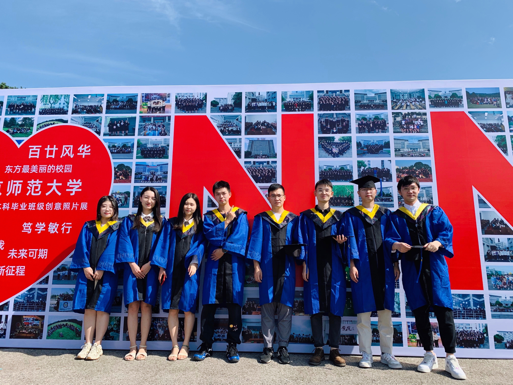

<table class="table table-striped table-bordered table-vcenter">
    <tr>
        <td>
            

                
                <a href=" ">关于一些2022年毕业的故事</a>
            

        </td>
        <!-- <td>
            

                
            

        </td>
        <td>
            

                
            

        </td>
    </tr>
    <tr>
        <td>
            

                
                

        </td>
        <td>
            

                
                

        </td>
        <td>
            

                
				<a href="https://claydon-wang.github.io/">SSSSS</a>
                

        </td> -->
    </tr>
</table>